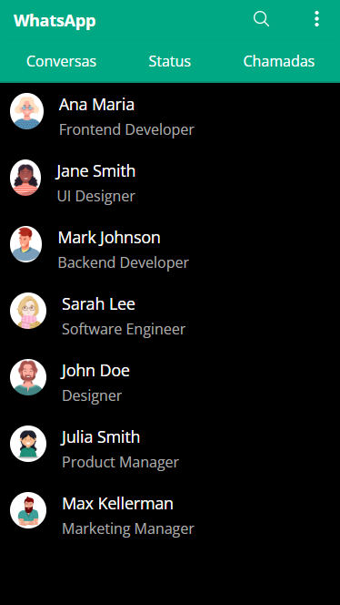
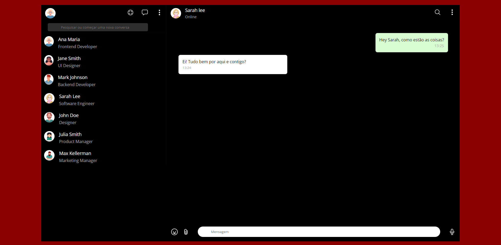

# WhatsApp

|      MOBILE         |          DESKTOP       |
|:-------------------:|:-----------------------:
|||
|                     |                        |

[Clique aqui](https://moreno1304.github.io/whatsApp/) para acessar o WhatsApp

---

## Sobre
WhatsApp Clone

O objetivo deste projeto é colocar em prática os conhecimentos, sobre desenvolvimentos em JS, HTML, CSS, adquiridos no curso do [SENAI JANDIRA](https://jandira.sp.senai.br/).

---

## Tecnologias utilizadas 
- HTML5
- CSS3
- Responsividade
- JS

---
## Autor
- [Moreno Cezar](https://github.com/Moreno1304)
# WhatsApp
# whatsApp
